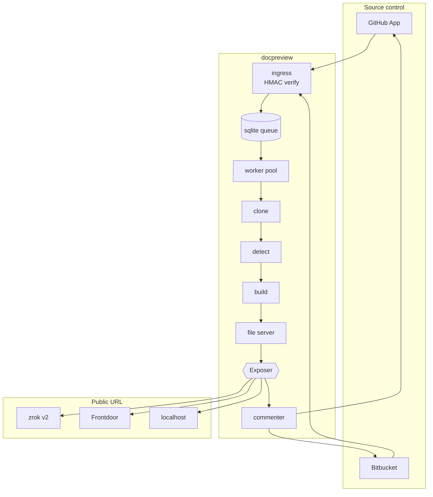

# Architecture

One Go binary, one sqlite file, one directory of build artifacts. Docker is optional. Kubernetes is not
involved.



## The two interfaces

Almost every design decision here follows from keeping two seams clean.

### `Exposer`

```go
type Exposer interface {
    Kind() string
    Validate(ctx context.Context) error
    Publish(ctx context.Context, spec Spec, h http.Handler) (*Publication, error)
    Reap(ctx context.Context, keep map[string]bool) error
    Close() error
}
```

It takes an **`http.Handler`**, not a port number. That is the load-bearing choice.

zrok's Go SDK hands back a listener on the OpenZiti overlay — a preview published through zrok binds no local
TCP port and does not appear in `netstat`. An interface that demanded a port would force zrok into a worse
shape to satisfy Frontdoor's needs. Handing over a handler lets each implementation bind whatever it actually
requires: the Frontdoor implementation binds a real port internally because its agent connects back over the
network, and the zrok one does not.

Three implementations, selected by one line of config. See [Exposers](./exposers.md).

### `scm.Client`

```go
type Client interface {
    Platform() model.Platform
    VerifyWebhook(ctx, headers, body) ([]Event, error)
    CloneURL(ctx, pr) (string, error)
    ChangedFiles(ctx, pr) ([]string, error)
    Publish(ctx, report) error
    Retract(ctx, pr) error
}
```

GitHub and Bitbucket disagree on nearly every detail — App-installation JWTs versus basic auth with an API
token, `PATCH` versus `PUT` to edit a comment, check runs versus build statuses — and agree on this shape.

`ChangedFiles` is on the platform rather than computed from git for a specific reason: working it out locally
means finding the merge base, which means fetching enough history to have one. Both hosts already know the
answer, and asking costs one request, which keeps the clone at `--depth 1`.

## Identity: two names doing two jobs

**Preview ID** — `sha256(platform|owner|repo|number)[:12]`.

Deliberately excludes the branch and the commit. A pull request keeps one preview for its whole life, even
through a force-push or a branch rename. This ID is what finds the comment to edit; if it moved, every push
would post a fresh comment.

**Public name** — the sanitized branch name, by default.

`feature/JIRA-123_new guide` is not a hostname, so it becomes `feature-jira-123-new-guide-a1b2c3`. The hash
suffix appears only when the transformation is lossy, so `main` stays `main`. Without it, `feature/foo` and
`feature_foo` would collapse to the same label and two open pull requests would silently steal each other's
URL.

The label is then prefixed with the repository — `docs-feature-jira-123-new-guide` — because the branch alone
is not unique across repositories, and every exposer keys a live publication on this name. Configurable via
`name_template`; see [the reference](reference/configuration.md#name_template) for the variants worth knowing.

Each preview gets its own share, its own name and its own listener, and each is withdrawn by preview ID rather
than by name. `Exposer.Reap` deletes anything carrying docpreview's target prefix that the database no longer
recognises — at startup, where by definition everything is an orphan, and on every sweep tick thereafter.

**Each build gets one too.** The branch name with the short commit appended, keyed on preview ID plus build ID, so a
reviewer can open the site as it was at a particular commit rather than only as it is now. Publishing it is best
effort: a failure there leaves the branch URL and the comment untouched. `preview.keep_builds` bounds how many are
kept — see [the reference](reference/configuration.md#every-build-gets-its-own-url).

## The queue

sqlite, with **at most one pending job per pull request**. A newer push replaces the pending job rather than
queuing behind it, and cancels any build already running for that pull request.

Both matter more than they sound. A reviewer fixing typos pushes five commits in two minutes; building all
five wastes four builds and publishes four previews nobody will look at before the fifth replaces them. A
superseded build also suppresses its own report, so a late failure cannot overwrite a perfectly good "ready".

Claiming a job is `DELETE ... RETURNING`, which is atomic in sqlite, so two workers cannot take the same one.
A build lost to a crash stays lost — recovered by the next push — rather than leaving a row stuck in
`running` forever, which is the failure mode that makes people write heartbeat systems.

## Identity: finding the comment again

There is no platform API for "the comment I made earlier". Storing comment IDs in the database means a restored
backup or a fresh install starts posting duplicates, so the comment identifies **itself**: a marker in its body,
carrying the preview ID. List the comments, find ours, edit it.

The preview ID is in the marker so two docpreview instances watching one repository — staging and production, say —
do not fight over a single comment.

The marker renders to nothing, and *how* it does that is not platform-neutral:

| Style | Text | Used by |
|---|---|---|
| HTML comment | `<!-- docpreview:9f2a1c4b7e01 -->` | GitHub, whose renderer honours raw HTML |
| Link reference | `[docpreview]: #9f2a1c4b7e01` | Platforms that escape raw HTML, where the first would render as a visible paragraph of literal text |

It is the first line of the body, so a truncated comment still identifies itself.

Matching accepts **both styles, always**. A daemon upgraded across a style change finds comments it wrote in the old
one, and a matcher that knew only the new style would post a second comment on every open pull request at once —
which is the exact failure the marker exists to prevent. A style can be added; none can ever be removed.

## Restart behaviour

On startup docpreview:

1. Reaps **every** remote share it owns. Nothing was serving them; the process that created them is gone.
2. Reads its preview table and republishes each one **from the artifacts already on disk** — the branch share
   first, then each retained build's own share.

Step 2 is why a restart does not re-clone and re-run twenty `npm install`s. If the republished URL differs from the
recorded one, the comment is updated — a comment pointing at a dead URL is worse than no comment.

The order cannot be relaxed. Reversed, step 1 deletes what step 2 just restored. The consequence is a window in
which every preview URL 404s, and under zrok it is not a short one: each publication is a round trip to the
controller at roughly 14 seconds, run serially. Three previews is about a minute. That is
[expected behaviour, not a fault](./troubleshooting.md#every-preview-404s-for-the-first-minute-after-a-restart).

It also means **one daemon per exposer account**. "Every share it owns" is identified by the zrok environment on
this host plus docpreview's own target tag, and nothing distinguishes two instances sharing an account — so each
restart of one deletes the other's live previews.

## Everything is best-effort in the right direction

Reporting to the pull request is best-effort: if GitHub is unreachable, the build still ran and the preview is
still live, so failing the build over a comment would throw away work that succeeded. The check run is
best-effort relative to the comment: losing the status line is cosmetic, losing the comment means the reviewer
never learns the preview exists.

The build itself is not best-effort. If the site does not build, or builds for the wrong base URL, the
preview is not published and the pull request is told why.
