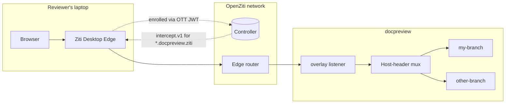

# Tunneler-only previews

:::info Built, and proven

The **exposer works**. `internal/expose/ziti.go` exists, `exposer.kind: ziti` is a valid configuration, and the
whole path has been exercised against a real OpenZiti controller, a real edge router, and a real Ziti Desktop
Edge install: enrol an identity, browse to `my-branch.docpreview.ziti`, read the docs. Turn the tunneler off
and the hostname stops resolving.

The **provisioning half is built too**, as [`docpreview configure ziti`](../reference/cli.md#configure-ziti)
rather than the `docpreview identity` verbs sketched in [CLI surface](#cli-surface) — one idempotent command
instead of four, because bootstrap was the only one anybody needed first. It creates every object below
through the edge management API and writes the docpreview config, so the whole path from nothing is
`ziti edge quickstart`, `docpreview configure ziti`, `docpreview serve`.

The ingress went the same way. `listeners` can bind an OpenZiti service instead of a TCP port, so the
dashboard and the webhook endpoint — which between them enumerate every open documentation pull request — can
live on the overlay alongside the previews. See [Configuration](../reference/configuration.md#listeners).

The rest of this page is the design and the research behind it, kept because the reasoning is durable —
particularly the negative result in [Why not zrok](#why-not-zrok), which closes off the approach most people
would try first.

:::

## The idea

Every exposer docpreview has today produces a **public** URL. zrok can gate it behind OAuth and Frontdoor can
put an IdP and a WAF in front, but in both cases the address exists on the internet and something has to decide
whether to let each visitor through.

A different shape: a preview reachable **only** from a machine running an OpenZiti tunneler with an enrolled
identity, and with no public surface at all. Not a URL that rejects you — a hostname that does not resolve, an
address that is not routable, and a service you have no right to dial.

Reviewers run [Ziti Desktop Edge for Windows](https://netfoundry.io/docs/openziti/how-to-guides/tunnelers/windows/)
(or `ziti-edge-tunnel`), which most NetFoundry-adjacent people already have. They open
`https://my-branch.docpreview.ziti` and it works. Anyone else gets NXDOMAIN.

For unreleased documentation that is a materially different posture from "public URL, unguessable name".

## Why not zrok

The obvious idea is to reuse what is already there: zrok already has private shares, and a private share is
already an OpenZiti service. Point a tunneler at it.

**This does not work, and it is closed by construction rather than by accident.**

A zrok private share creates a ziti service named after the share token
(`controller/share.go:488-500`), and attaches exactly one config to it — `zrok.proxy.v1`
(`sdk/golang/sdk/config.go:8`). Repository-wide greps for `intercept.v1`, `host.v1`, `clientConfig`,
`ziti-tunneler-client` and `ziti-tunneler-server` return **zero** matches across the zrok tree, in both v1 and
v2. A GitHub code search for `intercept.v1 repo:openziti/zrok` returns `total_count: 0`.

That absence is the answer. A tunneler builds its DNS table and its intercepts from the `intercept.v1` configs
of services it is allowed to dial. A service with no intercept config gives a tunneler nothing to resolve and
nothing to capture. It might appear in the service list; it can never be reached by opening a URL.

zrok does not need intercepts because both ends of a share are SDK code:

| End | Call |
|---|---|
| bind | `zctx.ListenWithOptions(shrToken, opts)` — `sdk/golang/sdk/listener.go:34` |
| dial | `zctx.DialWithOptions(shrToken, …)` — `sdk/golang/sdk/dialer.go:27` |

`zrok access private` dials the service by name over the SDK and terminates traffic in a local listener it
binds itself. There is no tunneler in the path and no reason for zrok to describe one.

Dial rights are also scoped shut. Private share creation makes a Bind policy and a service-edge-router policy
and deliberately **no** dial policy (`controller/share.go:502-536`). Dial rights come only from `POST /access`
(`controller/access.go:100-119`), which always grants `IdentityRoles: ["@"+envZId]` — and `envZId` is
validated (`controller/access.go:29-48`) to be a zrok *environment* identity owned by the calling account. An
externally-enrolled ziti identity cannot be granted dial rights through the zrok API at all.

Two escape hatches exist and neither helps. A zrok admin can mint a ziti identity through zrok
(`controller/createIdentity.go:37-56`) but that creates no dial policy for any share. Anyone with direct
management-API credentials on the underlying network can hand-author a dial policy — zrok will not know about
it, its garbage collector reaps by zrok tags, and the tunneler still has no intercept.

**Frontdoor is also not the door.** Its published OpenAPI covers shares, frontends, custom-frontends, agents
and executions. There is no endpoint-enrollment resource. Frontdoor is a public-ingress product; this is the
opposite requirement.

## What does work

docpreview talks directly to an OpenZiti network's **edge management API**, and hosts the preview from its own
enrolled identity.



One wildcard service. One intercept config. One listener. Everything per-preview happens in memory.

## The design

### One wildcard service, not one per pull request

The single most consequential decision, and the counterintuitive one.

A single service carries an `intercept.v1` covering every preview that will ever exist:

```json
{
  "protocols":  ["tcp"],
  "addresses":  ["docpreview.ziti", "*.docpreview.ziti"],
  "portRanges": [{"low": 80, "high": 80}]
}
```

The apex is listed explicitly because the wildcard matcher keys on the suffix `name[1:] + "."`, so
`*.docpreview.ziti` matches `foo.docpreview.ziti` but **not** bare `docpreview.ziti`
(`tunnel/dns/server.go:167`). Having the apex is useful anyway — it can serve an index of live previews.

Wildcards are a first-class address form. The tunneler allocates a synthetic IP lazily, the first time each
hostname is queried (`tunnel/intercept/iputils.go:111-123`):

```go
// handle wildcard domain - IPs will be allocated when matching hostnames are queried
if hostname[0] == '*' {
    err := resolver.AddDomain(hostname, func(host string) (net.IP, error) {
        return getDnsIp(host, addrCB, svc, resolver)
    })
}
```

One constraint: wildcards need the DNS-server resolver, which is the normal ZDEW and `ziti-edge-tunnel` mode.
The hostfile resolver rejects them outright (`tunnel/dns/file.go:54`).

**Because the tunneler is a layer-4 proxy, the HTTP `Host` header survives end to end.** The browser sends
`Host: my-branch.docpreview.ziti`, nothing rewrites it, and docpreview's overlay listener sees it verbatim.
That is the whole trick — routing by Host is what lets one service serve every preview.

Service-per-pull-request is the wrong shape, for four separate reasons:

- Every new service triggers a service-list update and DNS/NRPT rule churn on **every** connected tunneler. A
  busy repository would have ZDEW rewriting NRPT rules continuously.
- Each PR would need a config, a service, a Bind policy and a SERP: four management-API objects to create,
  four to delete, four ways to leak.
- ZDEW's identity tile lists services. Twenty open PRs means twenty entries scrolling past the reviewer.
- One bound service means one `Context.Listen` and one `http.Server`, instead of one listener per PR.

The wildcard model creates **zero** management-API objects per preview. Publishing becomes a map insert;
reaping becomes a map delete.

What you give up is per-preview authorization — everyone with the reader attribute can reach every preview. If
that is ever needed, do it in the HTTP handler, where the ziti listener can report the dialing identity
(`edge.Conn` carries it), rather than by multiplying services.

### It fits behind `Exposer` unchanged

`sdk-golang`'s `Context.Listen(serviceName)` returns an `edge.Listener`, which embeds `net.Listener`
(`ziti/edge/conn.go:68-77`). That is the same shape `internal/expose/zrok.go` already serves into, so the
"serve directly into the mesh, bind no local port" property carries over for free.

The one structural difference from every existing exposer: there is a **single** listener and a single
`http.Server` for the whole process, and `Publish` mutates a routing table rather than creating a listener.
That still sits comfortably inside the interface.

```go
type Ziti struct {
    cfg config.ZitiConfig
    log *slog.Logger

    ctx      ziti.Context   // ziti.NewContextFromFile(cfg.IdentityFile)
    listener edge.Listener  // ctx.Listen(cfg.ServiceName), opened once in Validate
    srv      *http.Server

    mu   sync.Mutex
    live map[string]http.Handler // host label -> preview handler
}

func (z *Ziti) Publish(ctx context.Context, spec Spec, h http.Handler) (*Publication, error) {
    z.mu.Lock()
    z.live[spec.Name] = h          // idempotent on Name by construction
    z.mu.Unlock()

    url := JoinURL("http://"+spec.Name+"."+z.cfg.Domain, spec.BaseURL)
    return NewPublication(url, spec.Name, func() error { z.withdraw(spec.Name); return nil }), nil
}
```

`Validate` loads the identity, confirms the service is visible and bindable, opens the listener and starts the
server — which satisfies the "Validate must reach the remote" contract in
[Exposers](../exposers.md#contract-for-implementations) for free.

`Reap` deletes map entries not in `keep`. No remote objects exist per preview, so there is nothing on the
controller to collect.

Configuration alongside the existing exposers:

```yaml
exposer:
  kind: ziti
  ziti:
    identity_file: /etc/docpreview/docpreview.json   # docpreview's own enrolled identity
    service: docpreview
    domain: docpreview.ziti
    name_template: "{{.Repo.Name}}-{{.Name}}"
    management_api: https://ziti-controller:1280     # only for the identity verbs
    reader_role: docpreview-reader
```

Management credentials go in the [vault](../reference/security.md#credentials-at-rest), the same treatment as
`frontdoor.api_token`, never in the YAML.

### Provisioning identities

Two pleasant surprises. `edge-api` and `sdk-golang` are **already indirect dependencies** via zrok, so
promoting them costs no new module graph. And zrok v2 ships public wrappers for this exact workflow at
`github.com/openziti/zrok/v2/controller/automation` — importable at zero dependency cost, and worth reading
before writing anything.

The management client, the simple way:

```go
caCerts, _ := rest_util.GetControllerWellKnownCas(apiEndpoint)
caPool := x509.NewCertPool()
for _, ca := range caCerts {
    caPool.AddCert(ca)
}
edge, err := rest_util.NewEdgeManagementClientWithUpdb(user, pass, apiEndpoint, caPool)
```

Creating a reviewer identity:

```go
&rest_model.IdentityCreate{
    Name:           &name,
    Type:           rest_model.IdentityTypeDefault,
    IsAdmin:        &falsePtr,
    RoleAttributes: &rest_model.Attributes{"docpreview-reader"},
    Enrollment:     &rest_model.IdentityCreateEnrollment{Ott: true},
}
```

:::warning The JWT is not on the create response

`CreateIdentityCreated.Payload` is a `CreateEnvelope` whose `Data` carries only `ID` and `_links`. The
enrollment token is on the **detail read**: `GET /identities/{id}` → `.Enrollment.Ott.JWT`
(`rest_model/identity_enrollments.go:44-54`).

So the flow is always create → detail → read the JWT. The `ziti` CLI does the same second GET
(`ziti/cmd/edge/create_identity.go:216-229`), and so does zrok (`automation/identity.go:104-109`). Anyone who
misses this concludes the API does not return tokens.

:::

Re-minting for a lost or expired token is `POST /enrollments` with
`{IdentityID, Method: "ott", ExpiresAt}`, or `POST /enrollments/{id}/refresh`.

Well-known config type IDs, verified in ziti's `controller/db/migration_initialize.go`:

| Config type | ID |
|---|---|
| `intercept.v1` | `g7cIWbcGg` |
| `host.v1` | `NH5p4FpGR` |

Safer than hardcoding either: `GET /config-types?filter=name="intercept.v1"` once at startup. And note
docpreview needs only `intercept.v1` — `host.v1` is for tunneler-hosted services, and docpreview binds the
service itself through the SDK.

#### Bootstrap objects

One-time, and `docpreview identity bootstrap` should create them idempotently:

1. `POST /configs` — the `intercept.v1` above
2. `POST /services` — `{name: "docpreview", encryptionRequired: true, configs: [<configId>]}`
3. `POST /service-policies` — Bind, `identityRoles: ["@<docpreviewIdentityId>"]`
4. `POST /service-policies` — Dial, `identityRoles: ["#docpreview-reader"]` — attribute-based, so adding a
   reviewer is one role attribute and needs no policy edit
5. `POST /service-edge-router-policies` — `{serviceRoles: ["@<serviceId>"], edgeRouterRoles: ["#all"]}`
6. An edge-router policy for the identities — **usually already present**. `ziti edge quickstart` creates
   `all-endpoints-public-routers` and `all-routers-all-services`. List first, create only if absent. Note the
   ERP uses `#public`, so routers must carry that attribute.

Role syntax is validated strictly (`controller/db/util.go:29-49`): every entry is prefixed `#` for a role
attribute or `@` for a name or id, and `#all` must be the only entry in its list.

#### NetFoundry as an alternative

A NetFoundry-hosted network works too, and the code is the same. NetFoundry's own provisioning guide drives
`POST /identities`, `POST /services` and `POST /service-policies` under
`https://{controller}/edge/management/v1/`, and documents the JWT at `.data.enrollment.ott.jwt` on the
identity detail — byte-for-byte the shapes above. Only authentication differs.

The NetFoundry Cloud v2 API also mints endpoints directly:

```
POST https://gateway.production.netfoundry.io/core/v2/endpoints
{"networkId":"…","name":"docpreview-alice","enrollmentMethod":{"ott":true},
 "attributes":["#docpreview-reader"]}
```

It returns **202 Accepted** — creation is asynchronous — and the resource carries a top-level `jwt`. Poll
`GET /core/v2/endpoints/{id}` until it is non-null. It reverts to null once the endpoint enrolls, which
doubles as a "has this reviewer enrolled yet?" signal.

### Getting the identity into ZDEW

ZDEW turns out to be automatable, which was not obvious going in.

**The GUI is a thin client over a named pipe.** `\\.\pipe\ziti-edge-tunnel.sock` for commands,
`\\.\pipe\ziti-edge-tunnel-event.sock` for events (`ServiceClient/DataClient.cs:116-117`). Framing is one line
of UTF-8 JSON terminated by `\n`, one JSON line back. Enrollment is a single message:

```json
{"Command":"AddIdentity","Data":{
  "UseKeychain":false,
  "IdentityFilename":"my-preview-reader",
  "JwtContent":"eyJhbGciOi…"
}}
```

`Code == 0` means success. Follow with `IdentityOnOff` to enable it.

What ZDEW accepts, checked against the source:

| Route | Available |
|---|---|
| `.jwt` file through the GUI | **Yes** — the primary path, `OpenFileDialog` filtered to `*.jwt` |
| Named pipe `AddIdentity` | **Yes** — what the GUI itself calls |
| Already-enrolled `.json` identity | **No** — no import path exists anywhere in the tree |
| URL enrollment | Only controller-URL + external JWT signer, not "fetch a token from a URL" |
| URL scheme handler (`ziti://`) | **None** |
| Command-line arguments | **None** — `OnStartup` ignores them entirely |
| Drop folder, registry, MDM | **None** for identities |

So: emit a `.jwt` for manual import as the zero-risk baseline. The pipe write is a strictly better experience
and needs no elevation — the GUI that performs the identical call runs `asInvoker`. Keep it behind a flag,
because the pipe is an internal contract of a component docpreview does not own.

### CLI surface

`cmd/docpreview/main.go` dispatches with a plain switch, so this is additive:

```text
docpreview identity bootstrap              create the config, service and policies, idempotently
docpreview identity add <name> [-o F.jwt]  mint a reviewer identity, write its enrollment token
docpreview identity list
docpreview identity remove <name>          without this there is no revocation story
```

## Reproducing the trial

`scripts/ziti-trial/` stands the whole thing up: a throwaway controller and router, the six bootstrap objects,
docpreview's hosting identity, and a reviewer enrolment token.

```bash
bash scripts/ziti-trial/up.sh          # controller + router, leave running
bash scripts/ziti-trial/bootstrap.sh   # everything else, idempotent
```

Then `exposer.kind: ziti` pointed at the generated `docpreview-host.json`, and
`docpreview preview -name my-branch ./www/build`. Import `reviewer-alice.jwt` into Ziti Desktop Edge and open
`http://my-branch.docpreview.ziti/`.

The controller runs **natively** rather than in Docker, which was the one practical surprise worth recording.
The tunneler is on the same Windows host, so advertising `localhost` means the identity's `ztAPI` and the
router address are both reachable with no port publishing, no `host.docker.internal`, and no advertised-address
juggling. Docker would have made a two-line script into an afternoon.

### What the trial actually confirmed

| Assumption | Result |
|---|---|
| An `edge.Listener` serves HTTP the same way a TCP one does | Confirmed — `Validate` binds and serves with no special handling |
| The `Host` header survives the overlay | **Confirmed** — three previews, three hostnames, one service, correct content each time |
| A Dial policy keyed on a role attribute grants access | Confirmed — a second identity with only `docpreview-reader` reached the service |
| Withdrawing removes a preview without touching the controller | Confirmed — 404 immediately after, no remote call |
| ZDEW imports a `.jwt` and resolves the wildcard | Confirmed on a real install |

The Host-header result is the load-bearing one. Had it failed, the design would need a service per pull
request and four management-API objects on every push.

## Open questions

**Which OpenZiti network.** The trial used a local throwaway controller, which sidesteps the question but does
not answer it. For anything real: self-hosted, or NetFoundry-hosted? This is a decision rather than a research
gap, and it gates the provisioning half of the feature.

**`.ziti` as a TLD.** `*.docpreview.ziti` never resolving publicly is the point, but it also means the link in
the pull request comment is dead on any machine without the tunneler running — including whatever renders link
previews. An alternative is a real subdomain the organization owns
(`*.preview.internal.example.com`) intercepted by the tunneler, which degrades to NXDOMAIN rather than an
invalid TLD.

**HTTPS or not.** The overlay transport is already mutually authenticated and encrypted, so plain HTTP on port
80 inside the tunnel is defensible. Browsers increasingly treat non-HTTPS origins as second-class, though a
static Docusaurus site probably does not care. Unverified.

**The DACL on the data pipe.** ZDEW sets a DACL only on its *monitor* pipe; the data pipe is created by
`ziti-edge-tunnel.exe`, whose source lives in another repository. Every indication is that a non-elevated user
can write to it, but this is inferred. One line settles it:
`(Get-Acl \\.\pipe\ziti-edge-tunnel.sock).Access`.

**Multiple ZDEW identities with overlapping intercept domains.** NRPT rule precedence decides. Not
investigated.

**NetFoundry v2 create-endpoint exact semantics.** The shape above comes from NetFoundry's docs and
`python-netfoundry`, not from a run against a live tenant. The 202-then-poll behaviour in particular wants
confirming.

## Effort

Assuming a network exists and docpreview has admin credentials for it.

| Piece | Size |
|---|---|
| `internal/expose/ziti.go` | ~250 lines, 1–2 days. It is `local.go` plus a ziti listener; the hard part is already proven in `zrok.go`. |
| Config additions and the `buildExposer` case | Under an hour |
| Management client | ~200 lines, 1 day — or much less, since `zrok/v2/controller/automation` already wraps every call |
| `docpreview identity {add,list,remove}` | ~150 lines, half a day |
| `docpreview identity bootstrap` | ~200 lines, 1 day. Idempotency is the fiddly part. |
| Tests | 1 day. The management client mocks the way `frontdoor_test.go` does; Host-routing is unit-testable with no network. |
| Documentation | Half a day |
| End-to-end against a real controller and a real ZDEW | 1–2 days, and this is where the surprises will be |

**Roughly one to one-and-a-half weeks.** Optional extras: named-pipe auto-enrolment on Windows (+half a day,
and it needs the DACL question settled), and per-preview authorization by dialing identity (+1 day).

## Sources

Source trees read: `openziti/zrok` v2 and v1.1.11, `openziti/desktop-edge-win`, and the module cache for
`ziti@v1.6.0`, `ziti/v2@v2.0.0`, `sdk-golang@v1.2.8`, `edge-api@v0.26.48`, `zrok/v2@v2.0.4`.

- [Tunneler config type intercept.v1](https://netfoundry.io/docs/openziti/learn/core-concepts/config-store/config-type-intercept-v1/)
- [Windows tunneler](https://netfoundry.io/docs/openziti/how-to-guides/tunnelers/windows/)
- [Private DNS on Windows using OpenZiti](https://blog.openziti.io/private-dns-on-windows)
- [Provision a network and service](https://netfoundry.io/docs/platform/api-guides/provision-network/)
- [OpenZiti enrollment](https://netfoundry.io/docs/openziti/learn/core-concepts/security/enrollment/)
- [NetFoundry v2 API docs](https://gateway.production.netfoundry.io/core/v2/docs/index.html)
- [python-netfoundry](https://github.com/netfoundry/python-netfoundry) — the best call-sequence reference for the v2 API

The full unedited research spike, with line-level citations for every claim above, is in
`.notes/ziti-tunneler-previews.md` in the repository.
