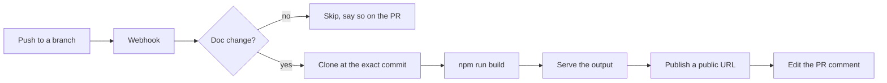

# docpreview

You push a commit to a branch. A minute later a bot comment appears on the pull request with a link, you
click it, and there is your documentation site — built from that branch, running at its own URL, ready to
read. When you push again the same comment updates in place. When the pull request closes, the preview
disappears.

That is what Vercel does for documentation repositories, and that is all this does. The difference is where
it runs: docpreview is a single Go binary you can start on a laptop, and the public URL comes from
[zrok](https://docs.zrok.io/) or [NetFoundry Frontdoor](https://netfoundry.io/docs/frontdoor/intro/) rather
than from somebody else's cloud.

If you are reading this page in a preview, docpreview built it from a pull request against its own repository.

## Why you might want this

**The docs you cannot send to a SaaS.** Unreleased documentation, internal runbooks, anything under embargo.
A hosted preview service means handing that content — and a repository access token — to a third party. Here
the build runs on your hardware and the content never leaves your network except through an ingress you
control.

**Bitbucket, or Bitbucket *and* GitHub.** Preview tooling clusters around GitHub. If your documentation lives
in Bitbucket, or in both, you end up either doing without or gluing two systems together.

**Because it should not be complicated.** A documentation site is a directory of static files. Serving one
behind a URL is not a distributed systems problem, and it should not require a control plane.

## What it actually does

Six steps, one process, one sqlite file. No Kubernetes. Docker is optional and only used to sandbox the build.

## What it deliberately does not do

- **Production deployments.** This builds previews. Shipping the site to production is your existing
  pipeline's job, and conflating the two is how a preview URL ends up in a search index.
- **Fork pull requests.** Building a fork means executing a stranger's `package.json` under your access
  token. docpreview refuses them at the webhook, before the payload is even queued.
- **Anything but static sites.** If your documentation needs a server at request time, this is the wrong
  tool. See [Jamstack](./background/jamstack.md) for why that is a feature.

## This site is the test subject

Everything you are reading lives in `www/` in the docpreview repository and is built by docpreview itself. If
the documentation renders, the tool works. That is not a cute trick — it is the integration test, and it is
the reason the `baseUrl` handling described in [Troubleshooting](./troubleshooting.md) is as paranoid as it is.

## Where to go next

- [Quickstart](./quickstart.md) — running locally in about ten minutes
- [Architecture](./architecture.md) — how the pieces fit and why they are shaped that way
- [GitHub App runbook](./runbooks/github-app.md) — the click-through you cannot avoid
- [age](./background/age.md) — what the credential vault is, if that name is unfamiliar
